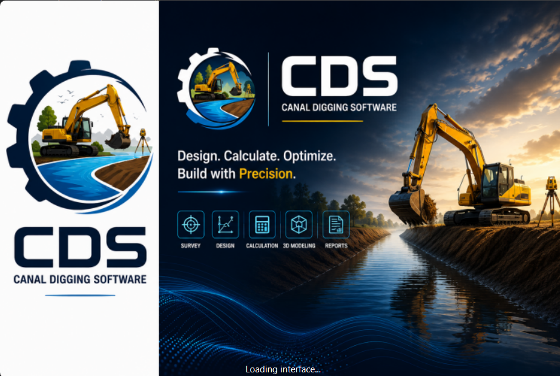
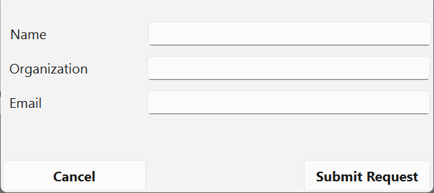
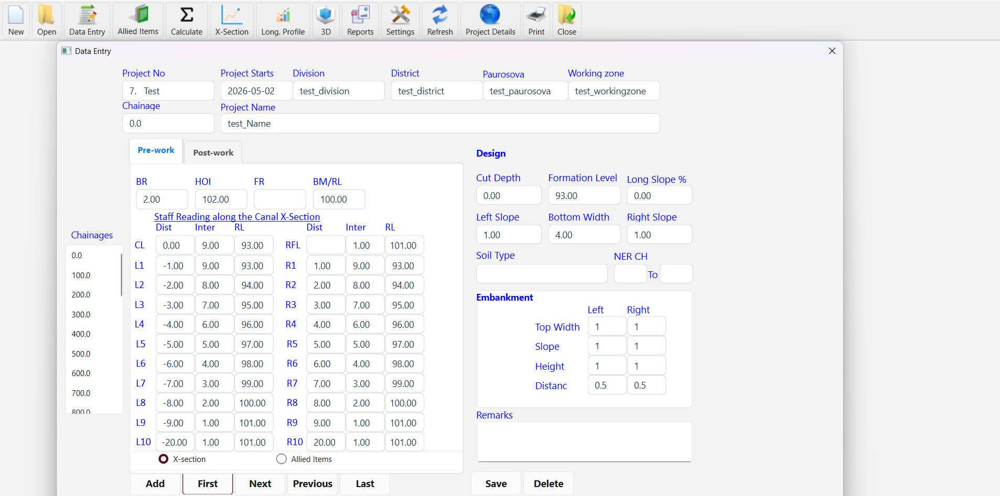
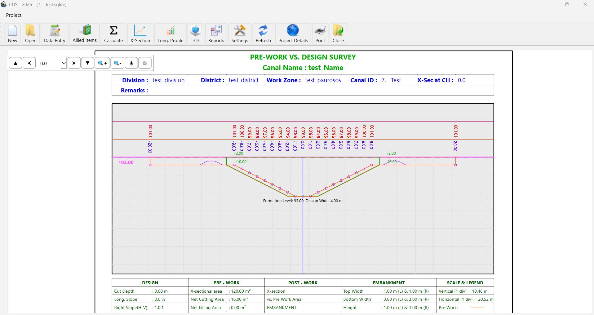
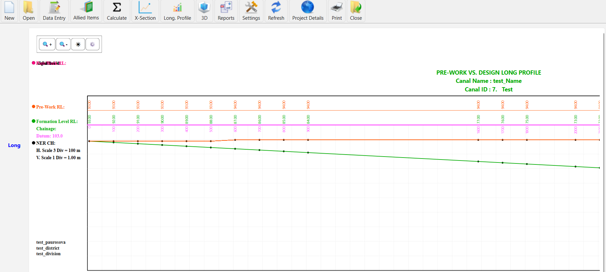
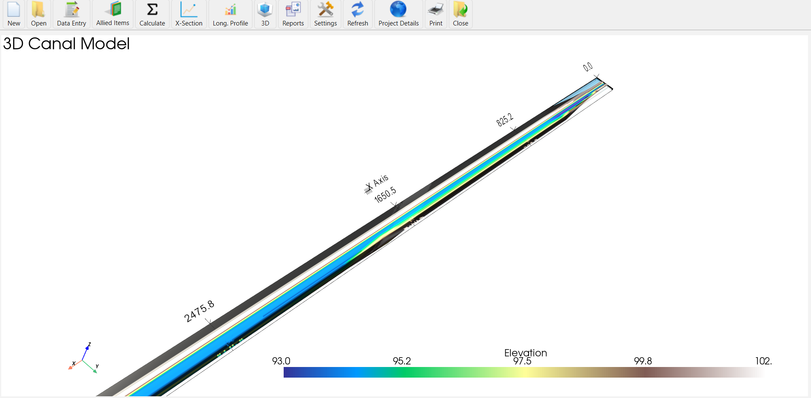
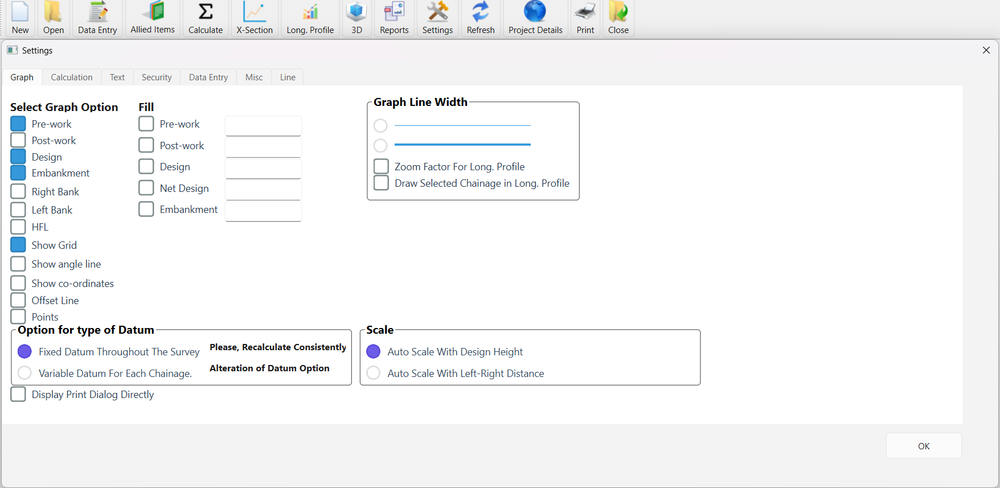
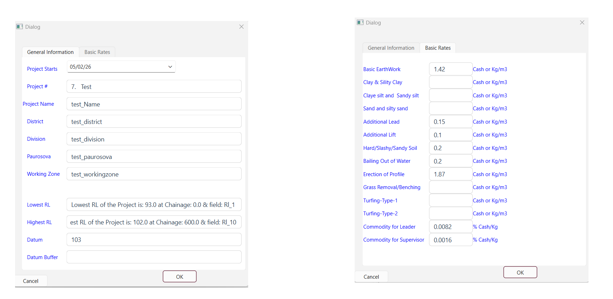
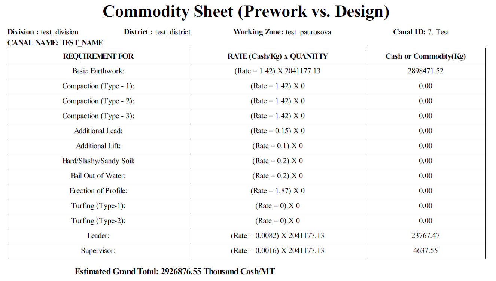
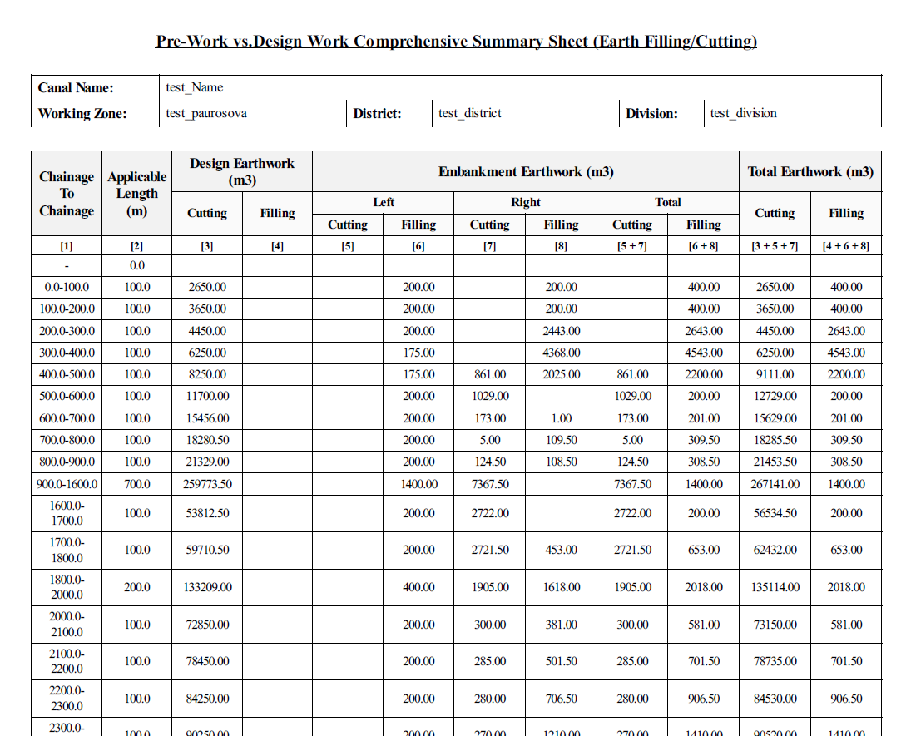

# CDS — Canal Digging Software

**CDS (Canal Digging Software)** is a desktop engineering application developed for canal excavation, earthwork calculation, cross-section analysis, quantity calculation, and engineering reporting.

The application is designed as a modern Windows desktop solution using **Python, PySide6, and SQLite**, with an interface and workflow inspired by traditional engineering database applications.

---

## Features

### Project Management

- Create and open CDS projects
- Project-based SQLite database
- Project details management
- Automatic project database creation from a template
- Project number and project name management
- District, Division and Paurosova information
- Project start date
- Working zone configuration
- BOX type and dimensional parameters

### Cross-Section Management

- Enter and edit chainage records
- Existing ground levels
- Design levels
- Left and right side measurements
- Soil type information
- Cut and fill calculations
- Cross-section visualization
- Automatic navigation between records
- First, previous, next and last record navigation

### Earthwork Calculation

CDS provides engineering calculations for:

- Existing ground profile
- Design profile
- Cut area
- Fill area
- Net area
- Excavation quantities
- Embankment quantities
- Cross-section-based calculations

### Graphical Visualization

The application provides graphical representations of engineering data, including:

- Cross-section diagrams
- Existing ground lines
- Design lines
- Embankment lines
- Grid and datum lines
- Cut/fill areas
- Long-section visualization

### Reports

CDS supports engineering reports and graphical output for project data and calculated quantities.

### Settings

Application settings allow users to configure:

- Decimal precision
- Line styles
- Line colors
- Text colors
- Graph appearance
- Report appearance

---

# Technology Stack

| Technology | Purpose |
|---|---|
| Python 3.13 | Application development |
| PySide6 | Desktop GUI |
| SQLite | Project database |
| PyInstaller | Windows executable |
| Inno Setup | Windows installer |
| Git / GitHub | Source-code management |

---

# Database

CDS uses **SQLite** for project data.

Newly created Project Database provides the initial database structure required by the application.

Project databases can then be created independently for individual projects.

This approach keeps each project self-contained and makes project backup and transfer straightforward.

---

# Windows Installer
* [ON REQUEST]
The production application can be packaged using **Inno Setup**.

The installer creates:

```text
C:\Program Files (x86)\CDS\
```

or the selected installation directory.

The installer can provide:

- Start Menu shortcut
- Desktop shortcut
- Application icon
- Uninstaller
- Automatic application launch after installation

---

# Authentication and Licensing

CDS includes an online authentication and licensing system.

# User Registration

When a new computer starts CDS for the first time, the application can display the registration form.

The user provides:

- Full name
- Organization
- Email address

The application automatically adds the computer identity information.

The registration is then submitted to the licensing server.

---

# License Activation

After administrator approval, CDS generates an activation token.

The user receives an activation email containing an activation link.

The activation process changes the license status from:

```text
Approved
```

to:

```text
Activated
```

After successful activation, the user can start CDS.

---

# Security

The application uses:

- HTTPS communication
- Password hashing on the server
- Activation tokens
- Activation expiry
- Server-side license validation
- User status management

Possible account states include:

```text
Pending
Approved
Activated
Rejected
Blocked
```

---

# User Interface

CDS is developed using **PySide6**, providing a native desktop application experience on Windows.

The application includes:

- Main window
- Project management
- Cross-section interface
- Long-section interface
- Reports
- Settings
- Authentication
- Splash screen
- Engineering visualization

---


# 📸 Screenshots

Add screenshots of the application here.

### SplashScreen



### Authentication



### Data Entry



### X-Section



### Longitudinal Profile



### 3D Model of Canal



### Reporting


### Options



### Project Setup




### Pre-work Level Book


### Summary Sheet


### Commodity Sheet



### Comprehensive Summary Report




This provides users with visual feedback while the application initializes.

---

# Project Workflow

A typical CDS workflow is:

```text
Create Project
      │
      ▼
Enter Project Details
      │
      ▼
Enter Chainage Data
      │
      ▼
Enter Existing Ground Data
      │
      ▼
Define Design Parameters
      │
      ▼
Calculate Cross Sections
      │
      ▼
Calculate Earthwork
      │
      ▼
Review Graphs
      │
      ▼
Generate Reports
```

---

# Development

## Recommended Development Environment

- Windows 10 / Windows 11
- Python 3.13+
- PyCharm
- Git
- SQLite
- Qt Designer

---
# Roadmap

Future development may include:

- [ ] Improved project dashboard
- [ ] Advanced cross-section editing
- [ ] Automatic quantity summaries
- [ ] Improved reporting system
- [ ] PDF report generation
- [ ] Excel export
- [ ] Advanced graphical customization
- [ ] 3D canal visualization
- [ ] Online license management
- [ ] Automatic application updates
- [ ] Cloud project backup
- [ ] Multi-language support

---

# License

CDS is proprietary software.

The source code is provided for authorized development and maintenance purposes only.

Unauthorized copying, redistribution, modification, or commercial use is not permitted without permission from the software owner.

---

# Author

**CDS — Canal Digging Software**

Developed as an engineering desktop application for canal excavation and earthwork management.

---

## Disclaimer

CDS is intended as an engineering calculation and project-management tool.

Users should verify engineering calculations, design parameters, quantities, and reports before using the results for construction or official engineering purposes.

---

## Status

**Development Status:** Active Development

**Platform:** Windows

**Application Type:** Desktop Engineering Software

**Primary Language:** Python

**GUI Framework:** PySide6

**Database:** SQLite

**Build System:** PyInstaller

**Installer:** Inno Setup
